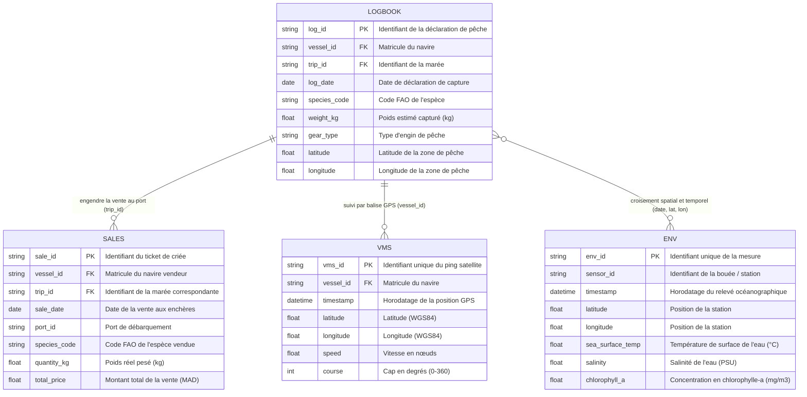

# 📊 Schéma Final des Données Sources (INRH Data Lake)

Ce document présente l'architecture finale des 4 sources de données du projet INRH, leurs relations, leurs types de données et les règles de validation associées.

---

## 🗺️ 1. Diagramme Entité-Relation (Mermaid)

---

## 📋 2. Dictionnaire Détaillé des Tables

### Table 1 : `VMS` (Système de Surveillance des Navires par Satellite)
* **Rôle métier :** Traçabilité continue de la flottille de pêche en mer.
* **Granularité :** 1 ligne = 1 position GPS émise par un navire à un instant $T$.

| Champ | Type | Contrainte | Description & Règles Métier | Anomalies Ciblées |
| :--- | :--- | :--- | :--- | :--- |
| `vms_id` | `VARCHAR(50)` | **PK**, Non Null | Identifiant unique du signal GPS | Doublons d'identifiant |
| `vessel_id` | `VARCHAR(30)` | **FK**, Non Null | Matricule du navire (ex: `MAR-1024-AG`) | Navire inconnu, champ vide |
| `timestamp` | `TIMESTAMP` | Non Null | Date et heure UTC du signal | Dates futures, trous temporels |
| `latitude` | `FLOAT` | Non Null | Latitude maritime du Maroc | Hors ZEE (20.5 à 36.0), point sur terre |
| `longitude` | `FLOAT` | Non Null | Longitude maritime du Maroc | Hors ZEE (-18.0 à -1.0), point dans le désert |
| `speed` | `FLOAT` | Non Null | Vitesse instantanée en nœuds | Vitesse < 0 ou vitesse > 35 nœuds |
| `course` | `INT` | Optionnel | Direction suivie (0° à 360°) | Cap négatif ou > 360° |

---

### Table 2 : `LOGBOOK` (Journal de Bord / Carnet de Pêche)
* **Rôle métier :** Déclaration légale obligatoire remplie par le capitaine du navire.
* **Granularité :** 1 ligne = 1 déclaration de capture par espèce lors d'une marée.

| Champ | Type | Contrainte | Description & Règles Métier | Anomalies Ciblées |
| :--- | :--- | :--- | :--- | :--- |
| `log_id` | `VARCHAR(50)` | **PK**, Non Null | Identifiant de la déclaration | Doublons de déclaration |
| `vessel_id` | `VARCHAR(30)` | **FK**, Non Null | Navire ayant effectué la pêche | Bateau non référencé |
| `trip_id` | `VARCHAR(50)` | **FK**, Non Null | Identifiant de la marée | Clé manquante |
| `log_date` | `DATE` | Non Null | Date de la capture déclarée | Date postérieure à la vente |
| `species_code`| `VARCHAR(10)` | Non Null | Code international FAO (ex: `PIL`, `OCC`) | Espèce interdite / en repos biologique |
| `weight_kg` | `FLOAT` | Non Null | Poids estimé pêché en kilogrammes | Poids négatif, poids nul, outlier (> 50t) |
| `gear_type` | `VARCHAR(30)` | Non Null | Engin (Chalut, Palangre, Senne) | Type d'engin non homologué |
| `latitude` | `FLOAT` | Non Null | Latitude de la zone de trait | Zone de pêche interdite / sur terre |
| `longitude` | `FLOAT` | Non Null | Longitude de la zone de trait | Incohérence avec la position VMS réelle |

---

### Table 3 : `SALES` (Ventes en Criée / Halle aux Poissons)
* **Rôle métier :** Enregistrement officiel de la transaction économique et de la pesée réelle au port.
* **Granularité :** 1 ligne = 1 lot de poisson vendu sous criée.

| Champ | Type | Contrainte | Description & Règles Métier | Anomalies Ciblées |
| :--- | :--- | :--- | :--- | :--- |
| `sale_id` | `VARCHAR(50)` | **PK**, Non Null | Numéro du ticket de vente | Doublon de facturation |
| `vessel_id` | `VARCHAR(30)` | **FK**, Non Null | Navire vendeur | Navire non conforme |
| `trip_id` | `VARCHAR(50)` | **FK**, Non Null | Marée rattachée à cette vente | Vente orpheline (sans marée associée) |
| `sale_date` | `DATE` | Non Null | Date de la vente aux enchères | Date de vente antérieure à la marée |
| `port_id` | `VARCHAR(30)` | Non Null | Port de débarquement (Agadir, Dakhla, etc.) | Port invalide |
| `species_code`| `VARCHAR(10)` | Non Null | Espèce vendue | Code espèce inexistant |
| `quantity_kg`| `FLOAT` | Non Null | Poids réel officiel pesé (kg) | Poids ≤ 0, écart massif vs `LOGBOOK` |
| `total_price` | `FLOAT` | Non Null | Montant total en Dirhams (MAD) | Prix total négatif ou nul |

---

### Table 4 : `ENV` (Données Océanographiques & Environnementales)
* **Rôle métier :** Paramètres scientifiques mesurés par bouées météo ou satellites INRH.
* **Granularité :** 1 ligne = 1 relevé environnemental horodaté pour une station.

| Champ | Type | Contrainte | Description & Règles Métier | Anomalies Ciblées |
| :--- | :--- | :--- | :--- | :--- |
| `env_id` | `VARCHAR(50)` | **PK**, Non Null | Numéro de relevé | Doublons de relevés |
| `sensor_id` | `VARCHAR(30)` | Non Null | Identifiant de la balise / station | Capteur inconnu |
| `timestamp` | `TIMESTAMP` | Non Null | Date et heure de mesure | Valeurs manquantes en série (panne) |
| `latitude` | `FLOAT` | Non Null | Position de la balise | Coordonnées aberrantes |
| `longitude` | `FLOAT` | Non Null | Position de la balise | Coordonnées aberrantes |
| `sea_surface_temp` | `FLOAT` | Non Null | Température superficielle en °C | Température hors plage (ex: < 10°C ou > 30°C) |
| `salinity` | `FLOAT` | Optionnel | Salinité océanique (PSU) | Valeur nulle en plein océan Atlantique |
| `chlorophyll_a` | `FLOAT` | Optionnel | Taux de chlorophylle ($mg/m^3$) | Valeurs extrêmes détectées via IQR |

---

## 🔗 3. Les Relations Clés pour le Contrôle de Qualité

1. **Relation `LOGBOOK` ➔ `SALES` (via `trip_id` et `species_code`) :**
   * **Contrôle croisé de volume :** $\text{quantity\_kg (SALES)} \approx \text{weight\_kg (LOGBOOK)}$.
   * *Alerte fraude :* Si $\text{quantity\_kg} > 1.5 \times \text{weight\_kg}$, déclaration sous-évaluée dans le journal de bord.
   * *Contrôle chronologique :* $\text{sale\_date} \ge \text{log\_date}$.

2. **Relation `LOGBOOK` ➔ `VMS` (via `vessel_id` et plage horaire) :**
   * **Contrôle de présence :** Le navire déclaré dans le Logbook doit avoir des pings VMS enregistrés dans la zone maritime (`latitude`, `longitude`) au moment du `log_date`.
   * *Alerte fausse déclaration :* Si le Logbook indique une pêche au large de Dakhla alors que le VMS montre le navire à quai à Casablanca.

3. **Relation avec `ENV` (via `date` et `proximité géographique`) :**
   * Permet d'associer les zones de fortes captures (Gold) aux conditions de température d'eau favorables (upwelling).
